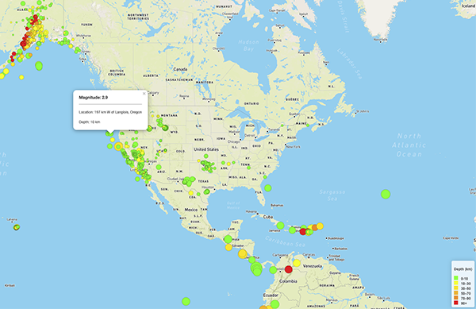

# leaflet-challenge
Mapping earthquake data using geoJSON, Leaflet, Javascript and Mapbox

### Creating an earthquake map

Used the [USGS GeoJSON feed](https://earthquake.usgs.gov/earthquakes/feed/v1.0/geojson.php) to grab earthquake data for the last 7 days.

Plotted the location of the returned geoJSON data to create circle markers whose size and color are correlated to the magnitude and depth of the quake. 

For more clarity, included a legend and popups over each datapoint that show the location, depth and magnitude of the quake. 
